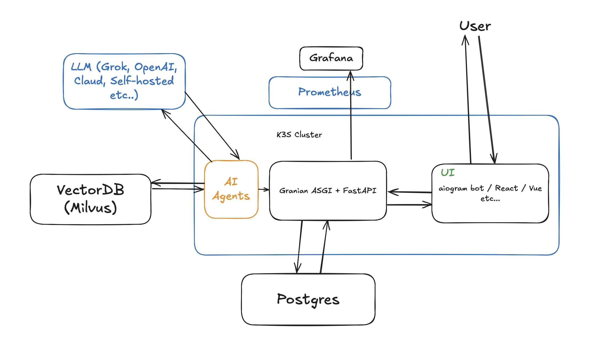

# Aссистент

## Стек
1. Асинхронный Python как основный язык для написания бота и веб-сервера
2. Postgres как основное хранилище
3. K3S как основной компьют
4. Парочка llmок (embedder (Qwen3-Embedding-4B) + reasoner (Qwen3-32B))

## Идея и механика
Пользователь приходит в бот иди любой другой фронт. Тот забирает у него минимальные контактные данные, далее начинается
общение. Фронт проксирует все запросы на бэкенд, бэкенд в своб очерель создает для него агента
(агент может ходить в векторную базу, чтоб достать оттуда информацию об описании программы, ее учебный план
(который из pdf переводился бы в структурированный json)). И дальше с этой информацией уже пошел бы в ризонер и тот на основе этого всего дела
выдавал бы ответ, который бэк потом бы возвращал. Ну в общем-то основная идея завести RAG. Так-же в фоне работают джобы
которые раз в единицу времени выкачивают информацию о программе и потом обновляют базу знаний.

P.S. Для помощника по двум программам выглядит как жуткий оверхед, но если масштабировать на универ то уже выглядит вроде бы очень даже

## Архитектура

## Статус
До конца времени успел только написать простой хендлер который принимает данные пользователя и записывет в базу. Придумал космический корабль, но не успел его сделать :(